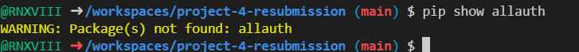

# Project 4 

## A website about restaurant booking

<h2></h2>

# features 

## The homepage 

<h2></h2>

## double booking

just like in the old project , the resubmission was able to cover this again and stop users from double booking 

## Authenticaton 

when starting the app you need an account to see whats what a small but helpful feature

## Features left to impliment

annoyingly there was some things i couldnt get done in time / didnt understand

- fix my tests (test was planned and impliemented but didnt get fixed)

- figure out whats wrong with all auth packages, then:

import allauth templates , include base.html and add css styling

<h2></h2>

its says it doesnt exist even after reinstalling it

# Languages used 

[Python](https://www.python.org/)

[HTML5](https://en.wikipedia.org/wiki/HTML5)
 

[CSS3](https://en.wikipedia.org/wiki/Cascading_Style_Sheets)

# Diagrams, Flowcharts and ERDS

not much planning was done as i had to keep switching and overcoming problems so i had to use what i learned
and created the project 

however there is an ERD for the bookings model which is here:

<h2></h2>

# agile tools (user stories)

as i was planning this had a notepad and a checklist to go through what ive done and using these to convert into user stories which helped me alot figure out what was done, needs to be done, or has been done.

[myuserstory](https://github.com/RNXVIII/project-4-blog)

# deployment

the tool used to deploy this project is heroku.

to deploy a simple heroku app, you need to setupp the enviroment to herokus needs and also to link your repository

to deploy your repository on to heroku is simple:

create/sign in to an account 

create an "app" 

link your github account to your heroku account 

search for your repository 

adjust your app_config to its needs

search for your repository 

deploy it!

# Validators 

i used the validator and heres what has passed and has not

the [W3C CSS validator](https://jigsaw.w3.org/css-validator/validator) passed!

the [W3C validator](https://validator.w3.org/) some templates passed!

the [PEP8](https://peps.python.org/pep-0008/) n/a

# Testing 

i made tests to test all areas of the CRUD functionality but due to some errors i cannot get my test to access the database

# Credit 

when trying to make this i had a better understanding of what everything does by reusing code from

Code Institues walkthrough project Django
[geeksforgeeks](https://www.geeksforgeeks.org/)
[w3schools](https://www.w3schools.com/)

there were other websites that gave me enlightment on certain bugs or issues but im unable to locate the exact websites
but i would like to emphisis how these helped me make my tests/plan it 

# Libaries and tools used

Font Awesome [icons](https://fontawesome.com/)

[bootstrap](https://getbootstrap.com/)

[google-Fonts](https://fonts.google.com/)

the packages i installed to make this was:

whitenoise
summernote
allauth
psycopg2
gunicorn

# Important

## why is the project like this?

overall this resubmission was trying to cover as much criteria as possible using what ive done from my previous project and plannning around that , it has much more into it than before but honestly lacks slighly less than whats needed and what i wanted.

overall i hope my documentation isnt too hard to read. 

it was exasperating but im still learning/relearning  an awful lot from this project

thank you for viewing this project.

## another thing 

some commits may be big due to either importing templates from old projects or dealing with an issue

when making the second app 'mystuff' for the profile stuff it went horribly and i moved all of my work into one commit once it all worked for more a less a clean commit rather than alot of smaller commits that could confuse the user, other the 2 big commits everything should be fine , appologies!

